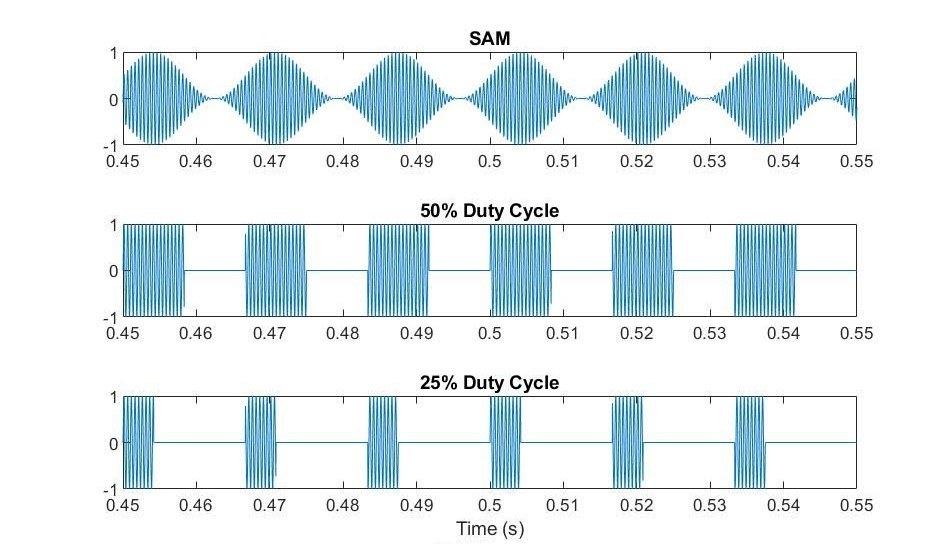
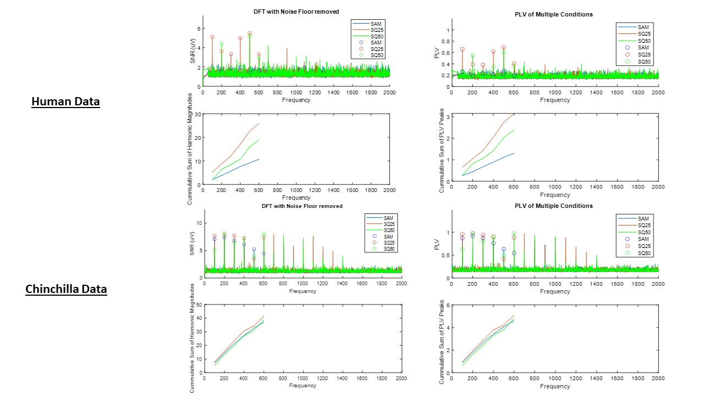
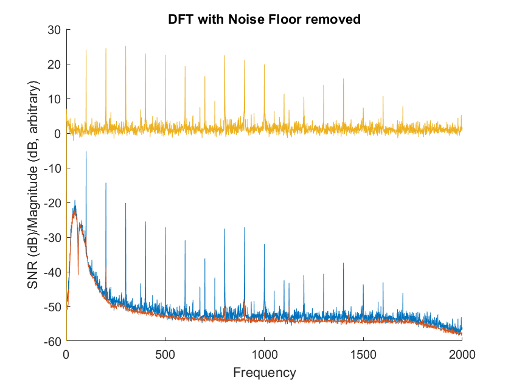
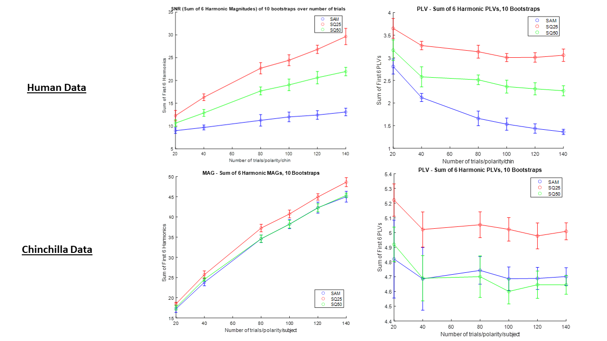

# Investigating the Diagnostic Potential of Auditory Stimuli in Synaptopathy- EFR Processing Code

The following scripts/methods were designed to calculate and analyze Phase Locking Values (PLVs) and spectral magnitudes of _**both**_ human and chinchilla Envelope Following Responses (EFRs). The original purpose of these scripts was to investigate the ability of three auditory stimuli: Sinusoidal Amplitude Modulation (SAM), Square Envelope with 25% duty cycle (SQ25), and Square Envelope with 50% percent duty cycle (SQ50), to discriminate Synaptopathy from normal hearing. 


***Figure 1.*** *Waveforms of tested stimuli. You can listen to them in [Sounds](Sounds).* 

The mathematic equations that were followed can be found in the appendix of a [paper](https://www.ncbi.nlm.nih.gov/pmc/articles/PMC3724813) by Li Zhu, [Hari Bharadwaj](https://github.com/haribharadwaj), Jing Xia, and Barbara Shinn-Cunningham.

Human data pre-processing was done in [MNE](https://martinos.org/mne/stable/index.html) and also used functions found in the [ANLffr](https://github.com/SNAPsoftware/ANLffr) package.

## Pre-Processing

The data that can be loaded into the main script, `EFR_Processing.m`, must be in a *.mat* format. Chinchilla data from NEL should be directly compatible, so long as it is a *.mat*. 

However, data collected in a *.bdf* format must be passed through the python `bdf2mat.py` script found in the **MNE_code** subfolder, in order to be processed properly. 

`bdf2mat(froot,fs,Fs_new,hpf,t_stim,topchans,trial_name)` simply converts the *.bdf* into a *.mat* format that can be read by the main script, `EFR_Processing.m`. It also prints out multi-tapered PLV and Spectral Magnitudes of the averages of all trials (not truncated, but epoch'd). 


### **Example:**
```
trial_name = 'SQ25'    
froot = "C:\\Users\\racqu\\Documents\\Research\\Purdue\\HumanData\\AS\\"+trial_name+'\\'
fs = 16384
Fs_new = 4e3
hpf = 70
t_stim = [0.0,1.5] 
topchans = [31] 


bdf2mat(froot,fs,Fs_new,hpf,t_stim,topchans,trial_name)
```

`trial_name` - the name of the condition/stimulus you're testing

`froot` - root directory of all conditions

`fs` - sampling frequency (Hz) of your data

`hpf` - cutoff frequency for high pass filtering 

`t_stim` - the window you're interested in pulling the data for the *.mat* file from

`topchans` -  channel of interest (don't believe my code works with multiple channels yet)

## Using `EFR_Processing.m`

`EFR_Processing.m` is an implementation of multiple methods, detailed later. It allows the user to bootstrap data using a single subject, and also calculate means and standard deviations of summations of harmonic magnitudes and PLVs related to a particular fundamental frequency, F0.

### **Parameters**:

```
isHuman = 0; %MAKE SURE THIS IS 1 for Human or 0 for Chin

subject = "Q379";

bstraps = 1; %simulated number of "chins"
%t_array = [20,40,80,100,120,140];%number of trials conducted/polarity/subject. Make this an array if you want to test multiple N
t_array = 100;

%Sampling
Fs0_Human = 4e3; %if subject is Human
Fs0_Chin = round(48828.125); %if subject is a Chin

Fs = 4e3; %What you want to downsample to
F0 = 100; %Fundamental freq of interest in Hz

iterations = 100;
window = [0.1,1.3]; %Window of interest, truncated onset and break in stimulus
gain = 20e3; %Gain (doesn't really matter since looking at SNR & PLV, used for magnitude accuracy)
%gain = 1;

K_MRS = 100; %number of distributions to average spectra and PLVs over
K_NF = 10; %number of iterations to average noise floor distributions over (outer average)
I_NF = 100; %number of distributions to average noise floor over (inner average)

harmonics = 6; %How many harmonics to sum
```
### **Particular parameters of note:**
*The appendix of the paper helps understand some of these parameters.*

`bstraps` - how many times to run each element in `t_array` used to simulate multiple subjects and determine a minimum number of trials

`t_array` - how many trials to sample from the total dataset (randomly selected). 

**NOTE: for a given element in t_array, 1/5th of the trials are selected for one distribution. `K_MRS` random distributions of N = 1/5th `t_array[i]` is calculated and averaged over frequency.**

`K_MRS`- how many distributions from a set of `t_array[i]` trials to average and compute a DFT (400 in the paper).

`K_NF` and `I_NF`- how many iterations and distributions, respectively, of the *spectral noise floor* estimate to compute (1000 and 100 in paper, but 10 and 100 seemed to also be sufficient). **Significantly increases runtime.** 


### **Figures:**
The following figures were generated by `EFR_Processing.m`:


***Figure 2.** These are the spectral SNRs (Linear Scale) and PLVs computed for each of the 3 EFRs in response to the 3 stimuli. The peaks at the fundamental frequency (100 Hz) and it's first 5 harmonics were summed to quantify each response. A method for analysis has not yet been finalized, however the benefits of a PLV approach will be explained later.*


**WARNING: Uncommenting figure-related lines and running with `bstraps`>1 & `t_array` with length>1 will result in an abomination of figures.**


## Using `getDFT.m`

`getDFT` returns a frequency vector, the spectral SNR (mean DFT magnitude with noise floor subtracted), and PLV of a given set of trials. It's a function called by `EFR_Processing.m` and has sub-functions `getSpectMag.m` & `getNoiseFloor.m`.

### Example (from `EFR_Processing.m`):

```  
        [SAM_f,SAM_DFT,SAM_PLV] = getDFT(SAM_tot,trials,window,Fs,Fs0,gain,K_MRS,K_NF,I_NF);
```

***Input***

`SAM_tot` - cell array including all trials of interest. Even number indices represent positive polarity trials, odd indices are negative polarity trials.

`trials` - number of trials to sample (per polarity) from `SAM_tot`. 

`window` - window of interest (sec), i.e. `[0.1 , 1.3]`

`Fs` - sampling freq you wish to resample to (Hz)

`Fs0` - sampling freq of the trials in `SAM_tot`

`gain` - total gain (if no gain use 1) of any amplifiers used in data collection

`K_MRS`, `K_NF`, `I_NF` - See explanation in [**Using `EFR_Processing.m`**](#using-efr_processingm).


***Output***

`SAM_f` - frequency vector

`SAM_DFT` - the mean spectral SNR vector

`PLV` - the mean PLV vector


## Using `getSpectMag.m`

`getSpectMag.m` computes the DFT and calculates the mean magnitude and PLV for a given set of trials. 

### Example (from `getDFT.m`):

```
    [f,MRS(i,:),PLV(i,:)] = getSpectMag(pos,neg,Fs,numtrials); 
```

***Input***

`pos` - cell array of positive-polarity trials

`neg` - cell array of negative-polarity trials. 

`Fs` - sampling frequency

`numtrials` - number of trials to select per polarity


***Output***

`f` - frequency vector

`MRS` - array of all spectral magnitudes as a function of `f` for each trial

`PLV` - array of all PLVs as a function of `f` for each trial


## Using `getNoiseFloor.m`

`getNoiseFloor.m` calculates and returns the spectral noise floor (red in below figure):


***Figure 3.*** *Example of noise floor removal. Blue = original magnitudes, Red = Noise Floor, Yellow = SNR*

Simply subtract the noise floor from the mean of MRS to get the SNR (yellow).
### Example (from `getDFT.m`): 

```
[~, floory] = getNoiseFloor(pos,neg,numtrials,I_NF,K_NF,Fs);

DFT = MeanDFT-floory;
```
***NOTE: `DFT` computed above is actually a measure of SNR, since the noise floor was removed.***


***Input***

`pos` - cell array of positive-polarity trials

`neg` - cell array of negative-polarity trials. 

`numtrials` - number of trials to select per polarity

`K_MRS`, `K_NF`, `I_NF` - See explanation in [**Using `EFR_Processing.m`**](#using-efr_processingm).


***Output***

`floory` - the noise floor

`~` - the frequency vector (unnecessary in this case, since it can be returned by `getSpectMag`.


## Using `getSum.m`

`getSum` is a method used in `EFR_Processing.m` for basic analysis based on the sum of N harmonic values (either SNR or PLV). It is responsible for calculating the data represented in the bottom two graphs of [Figure 2](Figures/PLV_MAG_Both.JPG).

### Example (from `EFR_Processing.m`):
```
[SAM_SUM,SAM_PKS,SAM_LOCS] = getSum(SAM_f,SAM_DFT_uv,F0,harmonics);
```

***Input***

`SAM_f` - frequency vector from SNR/DFT/PLV calculations

`SAM_DFT_uv` - a spectral SNR. 

`F0` - Fundamental frequency of interest (100 Hz in this case)

`harmonics` - How many harmonics to sum + 1 (since the F0 peak is included)


***Output***

`SAM_SUM` - The cummulative sum of the peaks. Take the last value if you want only the sum.

`SAM_PKS` - the y value of the peaks

`SAM_LOCS` - the x value of the peaks


## Plotting means and SD as a function of # of trials collected using `Plotter.m`

`Plotter.m`, found in [Processed Data](Processed%20Data), was made in order to help justify the number of trials we collected per subject. The ideal number of trials is the lowest number where the harmonic sums of the 3 stimuli stop overlapping:

 

***Figure 4.*** *Mean and SD of sums of harmonic SNRs and PLVs of one chinchilla and one human.* 

## Further Considerations 

-It appears that the sq25 stimulus appears to have a higher response than the other two stimuli based on PLV and SNR (more noticeably in the human subject). However, to confirm this higher response is due to the envelope characteristics, it is worth controlling for variations in the intensity and power of sq25 by presenting it with the same RMS as the SAM tone.

-One human subject (myself, allegedly normal hearing), and one chinchilla (normal hearing) are not representative of the general human and chinchilla populations. More data must be collected. Also, the response to the SAM tone was abnormally weak in the human trial. Possible the EEG gel dried up or was displaced.

-PLV, according to the paper, is a more *statistically sensitive* analysis than looking only at magnitudes/computing SNR. Additionally, one benefit of using PLV is that it is unitless and can be compared directly across subjects and conditions. It does not require calculating a noise floor ( drastically lessening runtime). 

-Is summing the peaks of either the SNR or PLV a good way to quantify and compare responses? Or is it worth separately comparing responses and phase locking at each F0 and its harmonics? 

-Looking for more places to cut out loops and vectorize will make things run faster.  

## Authors

**Andrew Sivaprakasam** - Purdue University & Indiana University School of Medicine, *Graduate Student & Medical Student*

Contact: [Email](mailto:asivapr@purdue.edu)

## Acknowledgements

-[Systems Neuroscience of Auditory Perception (SNAP) Lab](https://engineering.purdue.edu/SNAPLab)

-[Auditory Neurophysiology & Modeling Lab](https://engineering.purdue.edu/auditory/)

-[MNE](https://martinos.org/mne/stable/index.html)

-[ANLffr](https://github.com/SNAPsoftware/ANLffr)